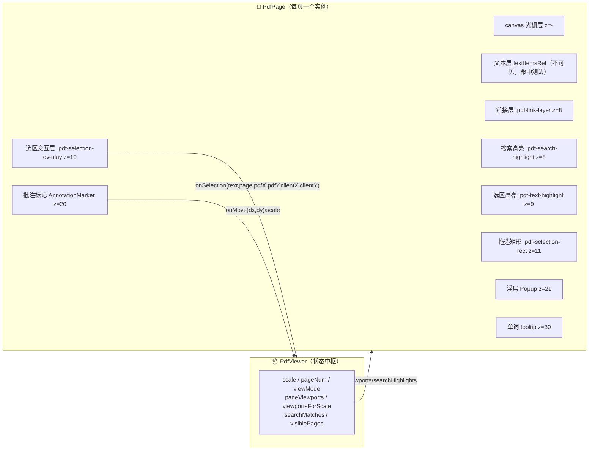
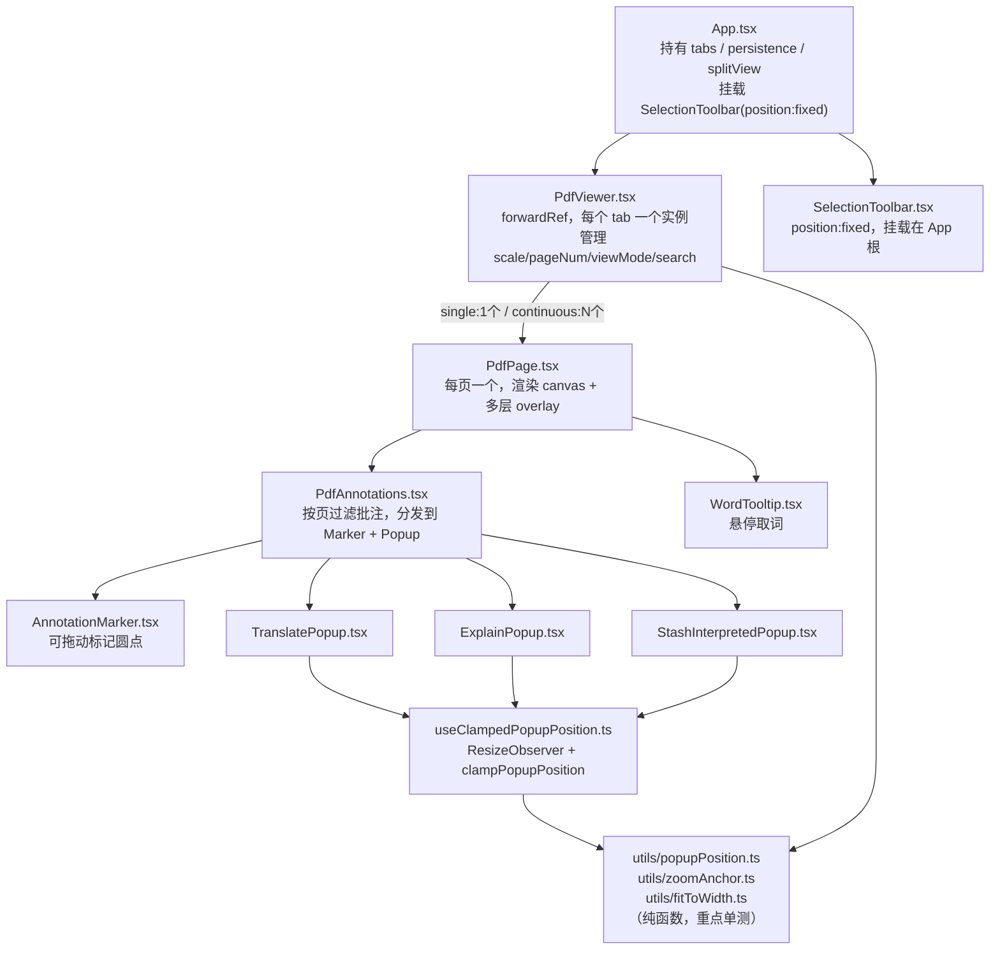
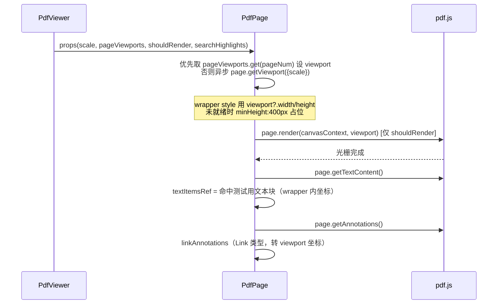
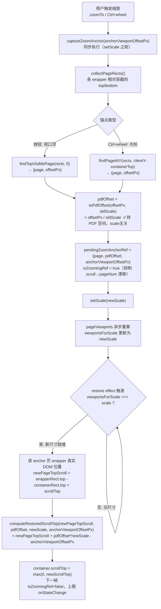
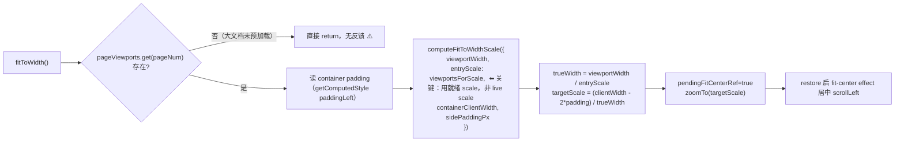
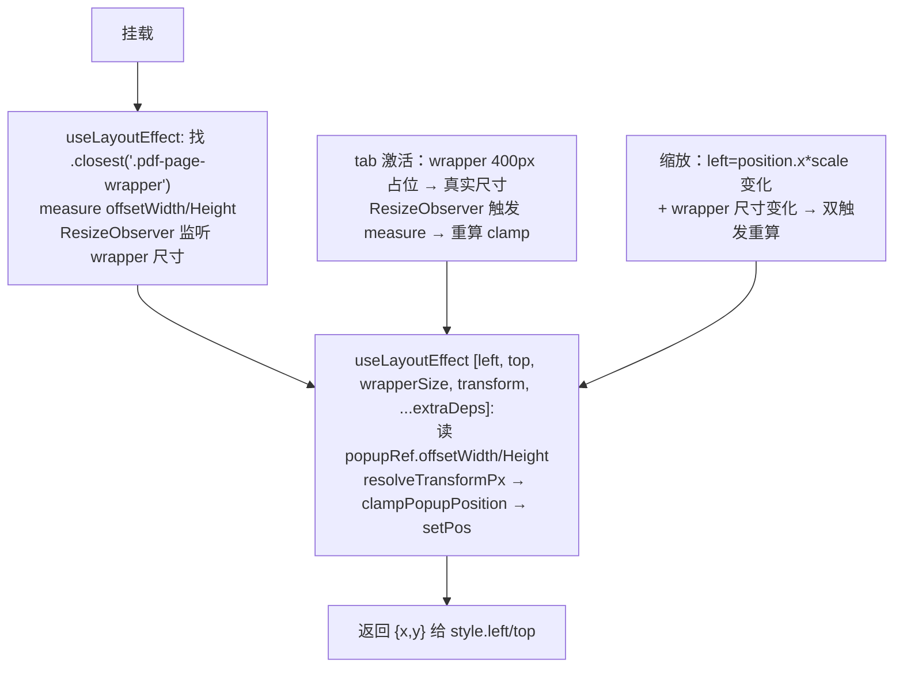
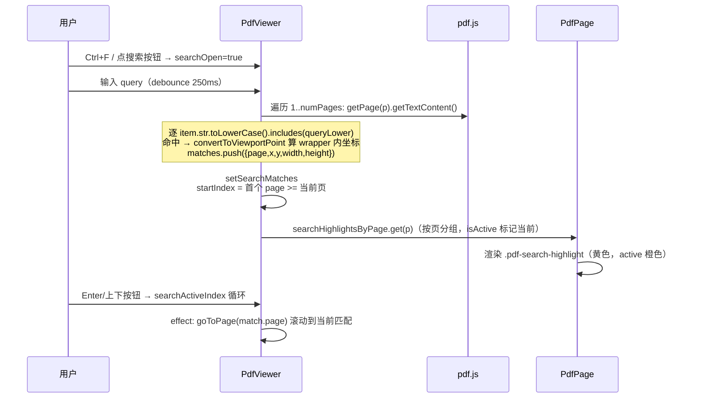
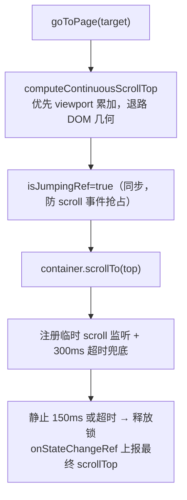
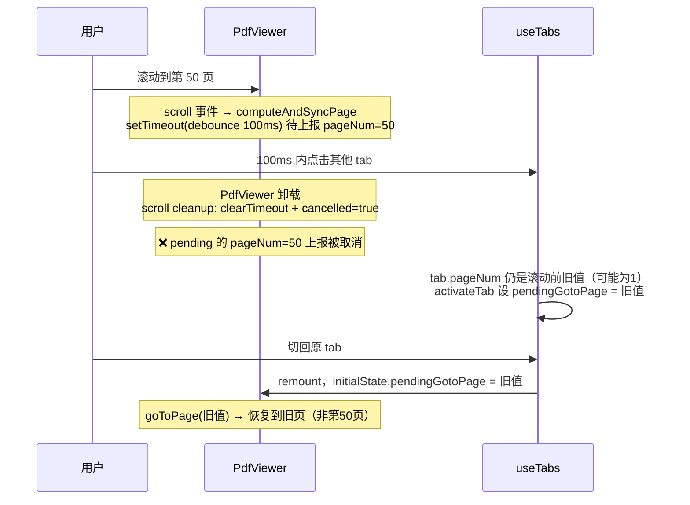
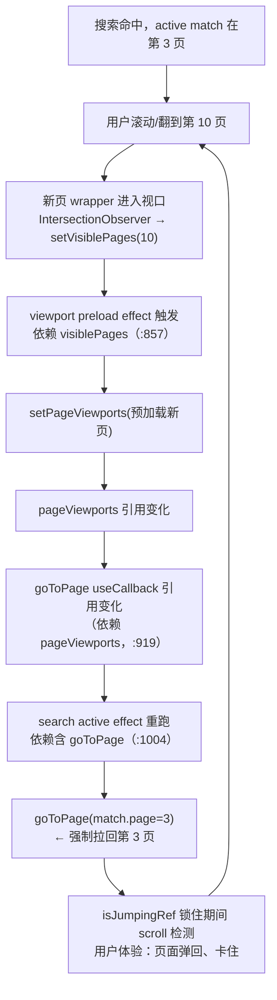

# SpecReader AI — PDF 渲染与浮层定位逻辑梳理

> 文档版本：v1.0 ｜ 生成日期：2026-07-16 ｜ 对应代码：`src/components/PdfViewer.tsx`、`PdfPage.tsx`、`PdfAnnotations.tsx`、`AnnotationMarker.tsx`、`TranslatePopup.tsx`、`ExplainPopup.tsx`、`StashInterpretedPopup.tsx`、`SelectionToolbar.tsx`、`WordTooltip.tsx`，及 `src/utils/{popupPosition,zoomAnchor,fitToWidth}.ts`、`src/hooks/useClampedPopupPosition.ts`
>
> 阅读对象：维护 PDF 显示/缩放/浮层/搜索相关逻辑的工程师。本文同时包含功能漏洞与逻辑错误检查结论（第 9 节）。

---

## 0. TL;DR（一图速览）



**三套坐标系贯穿全
文**（详见第 3 节）：PDF 原始坐标（持久化）→ wrapper 内坐标（×scale，渲染）→ 屏幕坐标（clientX/Y，仅 SelectionToolbar 用）。

---

## 1. 整体组件架构



**关键约定（来自历史修复，见项目 MEMORY）**：
- 弹窗定位一律走 `useClampedPopupPosition`，纯数学在 `popupPosition.ts`。
- 缩放保留滚动锚点，纯函数在 `zoomAnchor.ts`，`isZoomingRef` 抑制页码闪烁。
- `pageViewports` 缩放不清空，用 `viewportsForScale` 标记「就绪」。
- PdfPage wrapper 尺寸由 `viewport` state + 受控 `style` 驱动。
- jsdom 不做布局，定位/缩放数学抽成纯函数重点单测。

---

## 2. PDF 页面渲染流程

### 2.1 数据加载与 viewport 预加载

PdfViewer 在 `filePath` 变化时加载 PDF（`PdfViewer.tsx:379-466`），复用 `cachedBytes` 避免重复读盘。加载完成后：

1. **viewport 预加载**（`PdfViewer.tsx:809-857`）：按 `VIEWPORT_PRELOAD_THRESHOLD=50` 分流：
   - 小文档（≤50 页）：预加载全部页 viewport。
   - 大文档（>50 页）：只加载可见页 ±1 + 第 1 页 + 当前页。
   - **关键**：缩放时不清空 `pageViewports`，而是 `new Map(prev)` 增量覆盖，并用 `viewportsForScale` 标记「viewport 已对当前 scale 就绪」，避免 400px 占位塌陷。

2. **渲染页集合**（`PdfViewer.tsx:1304-1316`）：`renderPages = visiblePages ±1`（single 模式额外含 `pageNum`）。`shouldRender` 控制是否真正光栅化。

### 2.2 PdfPage 分层渲染

每个 `.pdf-page-wrapper`（`position:relative`）内部从下到上依次（z-index 见 `PdfPage.css`）：

| 层 | 元素 | z-index | 坐标系 | 说明 |
|----|------|---------|--------|------|
| 光栅 | `<canvas>` | — | canvas 像素 | pdfjs `page.render`，dpr 缩放 |
| 链接 | `.pdf-link-layer` / `.pdf-link-indicator` | 8 | wrapper 内 | `pageViewport.convertToViewportPoint` |
| 搜索高亮 | `.pdf-search-highlight` | 8 | wrapper 内 | 来自 `searchHighlights` prop |
| 选区高亮 | `.pdf-text-highlight` | 9 | wrapper 内 | 命中 textItems 的 bbox |
| 选区交互 | `.pdf-selection-overlay` | 10 | wrapper 内 | 捕获鼠标，`cursor:crosshair` |
| 拖选矩形 | `.pdf-selection-rect` | 11 | wrapper 内 | 拖选过程的临时框 |
| 批注标记 | `.annotation-marker` | 20 | wrapper 内 | `position.x*scale` |
| 浮层 | `.translate-popup`/`.explain-popup` | 21 | wrapper 内 | clamp 后 |
| 单词 tooltip | `.word-tooltip` | 30 | wrapper 内 | `translate(-50%,-100%)` |

### 2.3 渲染时序



> ⚠️ `PdfPage.tsx:187-188` 在 render effect 中**命令式**写 `wrapper.style.width/height`，与第 576-580 行受控 `style` prop 并存。两者值一致（同源 `viewport`），无功能 bug，但违反「禁止命令式写 wrapperRef」约定，属代码一致性问题（见 9.3）。

---

## 3. 坐标系统（核心，务必先读）

| 坐标系 | 用途 | 取值方式 | 持久化 |
|--------|------|----------|--------|
| **PDF 原始坐标** | 批注 `position.x/y`、`pdfX/pdfY` | `(wrapper内坐标) / scale` | ✅ 存 `{hash}.json` |
| **wrapper 内坐标** | 所有页内浮层/标记/高亮渲染 | PDF 原始 × scale，或 pdfjs `convertToViewportPoint` | ❌ |
| **屏幕坐标** | 仅 SelectionToolbar（`position:fixed`） | `e.clientX / e.clientY` | ❌ |

**闭环**（`PdfPage.tsx:546-567` 选区上报 → `usePersistence.ts:598,709` 创建批注）：

```
鼠标释放 onSelection(text, page, {
  x: e.clientX,        // 屏幕 → SelectionToolbar
  y: e.clientY,
  pdfX: (clientX - rect.left) / scale,   // → wrapper内 / scale = PDF原始
  pdfY: (clientY - rect.top)  / scale,
})
        │
        ▼
createAnnotation(type, text, page, selection.pdfX, selection.pdfY)
        │  annotation.position.x/y = PDF原始坐标（scale无关，缩放稳定）
        ▼
渲染时 AnnotationMarker: left = position.x * scale   // 还原 wrapper 内
        TranslatePopup:  left = position.x * scale → useClampedPopupPosition
```

**为什么持久化用 PDF 原始坐标**：缩放变化时批注位置不漂移，`×scale` 即得当前渲染坐标。拖动时 `onMove(dx,dy)` 同样先 `dx/scale` 再累加到 `position.x`（`PdfAnnotations.tsx:70-78`、`TranslatePopup.tsx:144-151`），保证增量与 scale 解耦。

---

## 4. 缩放、适合宽度与滚动锚点

### 4.1 三种缩放入口

| 入口 | 函数 | 锚点 | 适用模式 |
|------|------|------|----------|
| 按钮 / 输入框 | `zoomTo(target, 0)` (`PdfViewer.tsx:678`) | 视口顶部 | continuous |
| Ctrl+滚轮 | `handleWheel` → `captureCursorAnchor` (`:700-786`) | 光标点 | continuous |
| 适合宽度 | `fitToWidth` → `zoomTo` (`:1250`) | 视口顶部 | 两种 |

single 模式无滚动容器，缩放只改 `scale`，`pageNum` 不变即可，无需锚点。

### 4.2 锚点捕获-恢复流程（continuous 模式）



**纯函数职责**（`zoomAnchor.ts`，均有单测）：
- `findTopVisiblePage(pages, viewportTop)`：找跨过视口顶的页；顶部空白/页间隙/越界均收敛。
- `findPageAtY(pages, clientY)`：Ctrl+wheel 用，光标落在间隙返回 null（上层回退到视口顶）。
- `toPdfOffset(offsetPx, oldScale)`：转 PDF 空间。
- `computeRestoredScrollTop(...)`：还原公式。

### 4.3 适合宽度（`fitToWidth`）



> **关键修复点**（`fitToWidth.ts:1-11` 注释）：必须用 `viewportsForScale`（viewport 条目的真实 scale）而非 live `scale` 推算 trueWidth，否则缩放过渡期用旧尺寸算出过大 scale，页面比容器宽，居中后左移。

### 4.4 Ctrl+滚轮的增量累积（`PdfViewer.tsx:743-779`）

- 累积 `wheelDeltaRef`，每达阈值 100 触发 N 步；方向反转时清零，避免来回拉锯。
- **一次 burst 只捕获一次光标锚点**（`if (viewMode==='continuous') captureCursorAnchor(...)` 在步进循环外），保证整段缩放光标下文档点不动。

---

## 5. 浮层定位与边界 clamp

### 5.1 clamp 数学（`popupPosition.ts`）

浮层绝对定位在 `.pdf-page-wrapper` 内，CSS 带有 `transform: translate(-50%, 12px)`（Translate/Explain/StashInterpreted）。transform 会平移视觉盒，故 clamp 必须按**变换后**的视觉边计算：

```
视觉盒左边 = left + transformPx.x        （transformPx.x = -50% * popupW）
视觉盒右边 = left + transformPx.x + popupW
→ left ∈ [-transformPx.x, wrapperW - popupW - transformPx.x]   （y 同理）
```

- `resolveTransformPx(transform, popupW, popupH)`：解析 `translate(-50%, 12px)` 为像素（`%` 按 popup 尺寸折算）。
- `clampPopupPosition(left, top, popupW, popupH, wrapperW, wrapperH, transformPx)`：返回 `{x,y}`；wrapper 为 0（未测量）或 popup 比 wrapper 大（退化区间）时原样返回，不强推离屏。

### 5.2 useClampedPopupPosition（`useClampedPopupPosition.ts`）



**为何用 ResizeObserver**：tab 激活时 wrapper 起始是 400px 占位，viewport 异步加载后才到真实尺寸。仅在 mount clamp 一次会锁死在占位尺寸；监听 wrapper resize 可自动修正，无需用户交互。

**extraDeps 用法**：TranslatePopup 传 `[localContent, isStreaming]`，流式内容增长导致 popup 变高时重算 clamp；ExplainPopup/StashInterpretedPopup 内容固定，不传。

### 5.3 各浮层 transform 速查

| 组件 | CSS transform | clamp? | 坐标来源 |
|------|---------------|--------|----------|
| AnnotationMarker | `translate(-50%,-50%)` | ❌（圆点，无需） | `position.x*scale` |
| TranslatePopup | `translate(-50%, 12px)` | ✅ | `position.x*scale` |
| ExplainPopup | `translate(-50%, 12px)` | ✅ | `position.x*scale` |
| StashInterpretedPopup | `translate(-50%, 12px)` | ✅ | `position.x*scale` |
| SelectionToolbar | `translate(-50%, -100%)` | ❌（fixed） | `clientX, clientY-8` |
| WordTooltip | `translate(-50%, -100%)` | ❌ ⚠️ | wrapper 内 `pos.x, pos.y-4` |
| 搜索高亮 | 无 | ❌ | pdfjs viewport 坐标 |
| 链接/选区/文本高亮 | 无 | ❌ | wrapper 内 |

---

## 6. 搜索功能（已实现，注意文档过时）

> ⚠️ `AGENTS.md` 与项目 MEMORY 仍写「全文搜索未实现」，但代码中 PdfViewer **已完整实现**搜索面板、索引、高亮、导航、快捷键。属文档与代码不符（见 9.7）。

### 6.1 流程



### 6.2 关键点
- 索引依赖 `[searchOpen, searchQuery, pdf, numPages, scale]`（`PdfViewer.tsx:996`），**scale 变化会全量重建**。
- 高亮坐标在搜索时按当前 scale 用 `convertToViewportPoint` 计算，存的是 wrapper 内坐标（非 PDF 原始）。
- 快捷键：`Ctrl+F` 开、`Esc` 关、`Enter` 下一个、`Shift+Enter` 上一个（聚焦在搜索框时）。

---

## 7. 滚动与页码同步（continuous 模式）

### 7.1 scroll-driven 页码检测（`PdfViewer.tsx:1129-1201`）

不依赖 IntersectionObserver（异步、跳转后可能 stale），直接用 DOM 几何：遍历 `pageWrapperRefs`，找与视口相交且 `top` 最接近视口顶的页。`isJumpingRef`（跳转锁）和 `isZoomingRef`（缩放锁）抑制期间检测，防 pageNum 漂移。debounce 100ms + requestAnimationFrame。

### 7.2 goToPage 跳转锁（`PdfViewer.tsx:859-920`）



### 7.3 tab 切换恢复（`PdfViewer.tsx:471-514`）

PdfViewer 以 `key={tab.id}` 挂载，每个实例恢复一次：`pendingGotoPageRef` + `pendingScrollTopRef`，`hasRestoredRef` 保证只跑一次，避免后续 pageViewports 变化时用陈旧 scrollTop 覆盖用户跳转。

---

## 8. 双排视图与浮层

`useSplitView.ts` 仅管理 `isSplitView`/`secondaryTabId` 状态，**不涉及坐标计算**。两个 PdfViewer 实例各自独立容器，浮层 clamp 各自相对自己的 `.pdf-page-wrapper`，互不干扰。切换 split 时 PdfViewer 因 `key` 变化 remount，走 7.3 恢复流程。

---

## 9. 功能漏洞与逻辑错误检查

> 按严重度分级。仅罗列问题与影响，**不修改代码**（遵循用户审查约定）。

### 9.1 🟠 [Medium] 搜索高亮缩放过渡期错位
- **位置**：`PdfViewer.tsx:925-996`（search build effect 依赖含 `scale`）
- **现象**：缩放时 searchMatches 全量重建（debounce 250ms + 全页扫描）。重建期间旧 matches（旧 scale 的 wrapper 内坐标）仍在渲染，而 canvas/viewport 已按新 scale 重排 → 高亮位置与尺寸明显错位约 250ms~数秒（大文档更久）。
- **根因**：高亮坐标存的是 wrapper 内坐标（scale 相关）而非 PDF 原始坐标，故 scale 变必须重建。
- **建议**：命中存 PDF 原始坐标（`convertToPdfPoint`），渲染时 `×scale`；或重建期间临时隐藏高亮。

### 9.2 🟠 [Medium] WordTooltip 无边界 clamp
- **位置**：`WordTooltip.tsx` + `PdfPage.tsx:671-679`
- **现象**：tooltip 直接用 wrapper 内 `pos.x, pos.y-4` + `translate(-50%,-100%)`，**未走 useClampedPopupPosition**。页面顶部/左侧边缘的单词，tooltip 顶部或左半会被 `.pdf-canvas-container`（`overflow:auto`）裁切，显示不全。
- **对比**：Translate/Explain/StashInterpretedPopup 均有 clamp，唯独 tooltip 漏掉。
- **建议**：tooltip 走 clamp，或边缘时翻转方向（top→bottom）。

### 9.3 🟡 [Low] PdfPage render effect 命令式写 wrapper.style
- **位置**：`PdfPage.tsx:187-188`
- **现象**：render effect 内 `wrapper.style.width/height = viewport.width/height`，与第 576-580 行受控 `style` prop（`viewport?.width`）并存。值同源，无功能 bug，但违反项目 MEMORY「禁止命令式写 wrapperRef.current.style」约定。
- **建议**：删除命令式两行，完全由受控 style 驱动。

### 9.4 🟡 [Low] fitToWidth 大文档无反馈
- **位置**：`PdfViewer.tsx:1257-1258`
- **现象**：若 `pageViewports.get(pageNum)` 不存在（>50 页且当前页未预加载），`fitToWidth` 直接 return，按钮无任何反馈（不缩放、不提示）。
- **建议**：return 前可先触发该页 viewport 加载再重试，或给按钮 disabled/loading 态。

### 9.5 🟡 [Low] 搜索对大文档无分页/懒加载
- **位置**：`PdfViewer.tsx:941-988`
- **现象**：search build 同步遍历所有页 `getTextContent()`，200 页文档可能阻塞主线程数百 ms。与 viewport 预加载（阈值 50）不同步，搜索无分页/取消优先级。
- **建议**：分批加载（yield 到下一帧），或仅搜索可见页 + 按需扩展。

### 9.6 🟡 [Low] scale 变化时 searchMatches 全量重建
- **位置**：同 9.1
- **现象**：query 不变时每次缩放都重新扫描全部页文本。可缓存 PDF 空间命中，渲染时乘 scale，避免重复 IO。
- **建议**：与 9.1 合并修复（存 PDF 原始坐标）。

### 9.7 🟡 [Low] 文档与代码不符（搜索已实现）
- **位置**：`AGENTS.md` §1「明确未实现：全文搜索」、项目 MEMORY
- **现象**：实际 PdfViewer 已实现完整搜索（面板/索引/高亮/导航/Ctrl+F/Esc/Enter）。文档称未实现，误导维护者。
- **建议**：更新 AGENTS.md 与 MEMORY。

### 9.8 🟡 [Low] 拖动批注每帧 setState + debounce 保存
- **位置**：`AnnotationMarker.tsx:79-93`、`TranslatePopup.tsx:134-152`、`TranslatePopup.tsx:120-125`（debounce 300ms 保存 effect）
- **现象**：拖动时 `onMove` 每次鼠标移动都 `onUpdate`（写 `position`），触发父级 re-render + 300ms debounce 落盘。性能可接受，但高频 setState 在大量批注时可能卡顿。
- **建议**：拖动中用本地 ref 累积，松手时一次性提交（ransient drag）。

### 9.9 🔵 [Info] 缩放与搜索跳转的 scrollTop 竞争（低概率）
- **位置**：zoom restore effect（`:1208-1245`）与 search active effect（`:999-1004`）都写 `container.scrollTop`
- **现象**：极端时序下，缩放 restore 与 search `goToPage` 可能争夺 scrollTop。两者都有锁/防抖，实测不易触发。
- **建议**：观察是否复现，必要时加优先级。

### 9.10 🔵 [Info] useClampedPopupPosition 双触发重算
- **位置**：`useClampedPopupPosition.ts:57-78`
- **现象**：缩放时 `left=position.x*scale` 变化（触发）+ wrapper 尺寸变化（ResizeObserver 触发）会先后两次 clamp。无害，仅多余一次计算。
- **建议**：可忽略。

---

## 10. 用户场景验证（2026-07-16 二轮确认）

> 本节针对用户提出的 4 个典型使用场景，逐一确认是否复现并定位根因。4 项均**确认会复现**，属第 9 节代码审查之外的交互/时序类问题，可纳入下一轮修复清单。

### 10.0 总览

| # | 场景 | 会复现? | 严重度 | 触发条件 |
|---|------|---------|--------|----------|
| 10.1 | 多 tab 切换后回到第一页 | ✅ 会（条件性） | Medium | 滚动停在某页后 100ms 内切换 tab |
| 10.2 | 搜索中无法翻页离开当前搜索项所在页 | ✅ 会 | High | 搜索命中后用户主动滚动/翻到其他页 |
| 10.3 | 适合宽度后位置偏移 | ✅ 会（横向） | Medium | 任意 fitToWidth 触发，缩放过渡期 viewport 异步加载 |
| 10.4 | translation 浮层拖拽不灵活/拖不动 | ✅ 会 | Medium | 在 popup header 区域拖动 / 拖动中鼠标移出 body |

---

### 10.1 场景一：多 tab 切换后页面重置为第一页

**结论：会复现，属时序竞争（条件性）。**

`PdfViewer` 以 `key={tabs.activeTab?.id}` 挂载（`App.tsx:563`），切换 tab 即 **remount**。恢复位置依赖 `tab.pageNum`，而 `activateTab`（`useTabs.ts:66`）设 `pendingGotoPage = tab.pageNum ?? 1`。



**根因**：scroll-driven 页码检测有 **100ms debounce**（`PdfViewer.tsx:1174` 的 `setTimeout(..., 100)`）。切 tab 触发卸载，scroll listener 的 cleanup（`:1195-1199`）执行 `clearTimeout(debounceTimeout)` + `cancelled=true`。若用户滚动后 100ms 内切换 tab，pending 的 pageNum 上报被取消 → `tab.pageNum` 仍是旧值 → 切回恢复到旧页。

**次要因素**：大文档（>50 页）`scrollTop` 恢复时，未预加载页是 400px 占位，`scrollHeight` 不足导致 `scrollTop` 被 clamp 到占位容器的最大值，即使 `tab.scrollTop` 正确也无法落到精确位置。

**修复方向**：滚动时把 pageNum 同步写入 ref 即时上报（不依赖 debounce 触发），或 `activateTab` 切换前 flush pending 上报。

---

### 10.2 场景二：搜索中无法翻页离开当前搜索项所在页

**结论：会复现，是最隐蔽且影响最直接的一个——用户翻页会被强制拉回。**

`searchActiveIndex` effect（`PdfViewer.tsx:999-1004`）：

```js
useEffect(() => {
  if (searchActiveIndex < 0 || ...) return;
  const match = searchMatches[searchActiveIndex];
  goToPage(match.page);          // ← 拉回 active match 所在页
}, [searchActiveIndex, searchMatches, goToPage]);  // ← 依赖 goToPage
```

`goToPage` 是 `useCallback` 依赖 `[numPages, viewMode, pageViewports]`（`:919`）。`pageViewports` 在 viewport 预加载 effect（`:857`，依赖含 `visiblePages`）中被 `setPageViewports` 更新。



**根因**：search effect 把 `goToPage` 列入依赖，而 `goToPage` 因 `pageViewports` 变化而刷新引用 → 用户翻页触发新页 viewport 预加载 → `pageViewports` 变 → `goToPage` 变 → search effect 重跑 → `goToPage(match.page)` 把用户拉回 active match 所在页。形成"翻页即被拉回"的死循环。`goToPage` 的 jump lock 还会抑制期间 scroll-driven 检测，体验上像是"页面卡住弹回"。

**修复方向**：search effect 仅在 `searchActiveIndex`（用户主动切换匹配项）或 `searchMatches`（重新搜索）变化时跳转，去掉 `goToPage` 依赖（用 `useRef` 持有 `goToPage`），避免 viewport 预加载副作用触发重跳。

---

### 10.3 场景三：适合宽度后位置偏移（横向）

**结论：会复现，偏移方向是横向。**

`fit-center` effect（`PdfViewer.tsx:320-332`）：

```js
useEffect(() => {
  if (!pendingFitCenterRef.current || pageViewports.size === 0) return;
  pendingFitCenterRef.current = false;          // ← 首次即清空
  ...
  requestAnimationFrame(() => {
    const maxScrollLeft = container.scrollWidth - container.clientWidth;
    container.scrollLeft = maxScrollLeft > 0 ? maxScrollLeft / 2 : 0;
  });
}, [pageViewports, viewMode]);   // ← 缺 viewportsForScale===scale 门控
```

对比 `zoom restore` effect（`:1212`）有 `if (viewportsForScale !== scale) return;` 门控，等待 viewport 真正就绪后才恢复滚动。

**根因**：缩放过渡期 viewport 是**异步分批预加载**的（`loadViewports` 内 `await pdf.getPage`，`:830`）。`pendingFitCenterRef` 在首次 `pageViewports` 变化时即清空并居中，但此时部分页 wrapper 仍是 400px 占位（viewport 未就绪）→ `container.scrollWidth` 基于占位尺寸 → 居中计算错误 → 横向偏移。且 `pendingFitCenterRef` 已清空，后续 viewport 就绪也不会重试，偏移被固化。

**修复方向**：fit-center effect 加 `if (viewportsForScale !== scale) return;` 门控，与 zoom restore 对齐；或保留 `pendingFitCenterRef` 直到 viewport 就绪。

---

### 10.4 场景四：translation 浮层拖拽不灵活/拖不动

**结论：会复现，根因是鼠标事件绑定位置错误。**

`TranslatePopup.tsx` 的事件绑定结构：

```jsx
<div className="translate-popup-header" onMouseDown={handleMouseDown}>  {/* 只有 down */}
  ...
</div>
<div className="translate-popup-body"
     onMouseMove={handleMouseMove}      {/* move 绑在 body */}
     onMouseUp={handleMouseUp}
     onMouseLeave={handleMouseUp}>      {/* 离开 body 即停止 */}
  ...
</div>
```

问题链路：
1. 鼠标在 header 按下后，在 header 上方移动 → **header 没有 `onMouseMove`** → 不触发拖动，表现为"拖不动"。
2. 必须移到 body 区域才触发 move；拖动中 popup 跟随移动，鼠标一旦脱离 body（弹到 header 或 popup 外）→ `onMouseLeave` → `isDragging=false` → 停止拖动。
3. **无全局 `document`/`window` mousemove 监听**，鼠标移出 popup 区域完全丢失事件，无法继续拖动。

**对比**：`AnnotationMarker`（`:79-100`）虽同模式，但 marker 仅 24px 且拖动时 marker 跟随鼠标，鼠标基本不离 marker，问题较轻。TranslatePopup 体积大、header 与 body 分离，问题显著。

**修复方向**：`handleMouseDown` 时在 `window` 上注册一次性 `mousemove`/`mouseup` 监听（拖拽标准实现），或在 header 也绑 move；拖动结束移除监听。

---

### 10.5 与第 9 节的关系

第 9 节是**代码审查**发现的潜在漏洞（多在边界条件、一致性、性能），部分未必被用户感知。本节是**用户场景验证**，4 项均确认可复现且影响交互体验，属优先修复项。两者交叉点：10.4（拖拽）与 9.8（拖动每帧 setState）同源但角度不同；10.2（搜索拉回）与 9.9（scrollTop 竞争）相关但 10.2 是确定性的拉回循环，9.9 是低概率竞争。

---

## 11. 纯函数与单测索引

| 文件 | 职责 | 单测 |
|------|------|------|
| `utils/popupPosition.ts` | clamp 数学 + transform 解析 | `popupPosition.test.ts` |
| `utils/zoomAnchor.ts` | 锚点查找 + PDF 偏移 + scrollTop 还原 | `zoomAnchor.test.ts` |
| `utils/fitToWidth.ts` | 适合宽度 scale 计算 | `fitToWidth.test.ts` |
| `PdfViewer.computeContinuousScrollTop` | 连续模式跳转 scrollTop（viewport 累加/DOM 退路） | `PdfViewer.pageJump.test.tsx` |
| 组件接线 | useClampedPopupPosition/缩放/选区 | `PdfViewer.zoom.test.tsx`、`PdfViewer.state.test.tsx`、各 `*.test.tsx` |

> TDD 约定：jsdom 不做布局（offsetWidth=0，ResizeObserver 空 mock），故定位/缩放数学抽成纯函数重点单测；组件层用「可控 ResizeObserver」测接线。

---

## 12. 维护备忘

- 改浮层定位 → 先看 `useClampedPopupPosition` + `clampPopupPosition`，注意 transform 是否变化（`PopupTransformSpec`）。
- 改缩放 → 同步检查 `captureZoomAnchor` / `restore effect` / `isZoomingRef` / `viewportsForScale` 四处，任一缺失都会导致跳页或锚点失效。
- 改搜索 → 注意 scale 依赖（9.1/9.6），优先把命中坐标迁到 PDF 原始空间；注意 search active effect 的 goToPage 依赖会触发翻页拉回（10.2）。
- 新增页内浮层 → 默认接入 `useClampedPopupPosition`，避免重蹈 WordTooltip 边界问题（9.2）。
- 改拖拽交互 → 用全局 mousemove/up 监听，勿绑在浮层内部子元素上（10.4）。
- 改 tab 切换恢复 → 注意 scroll 上报 debounce 与卸载 cleanup 的竞争（10.1），切换前 flush pending 状态。
- 改 fitToWidth → 居中 effect 必须等 `viewportsForScale===scale`，与 zoom restore 对齐（10.3）。
